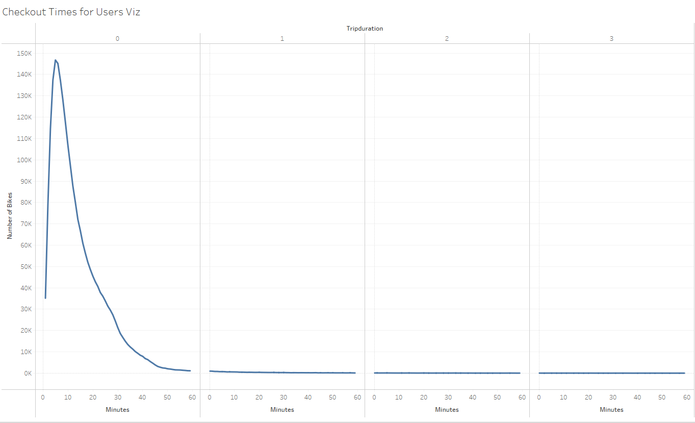
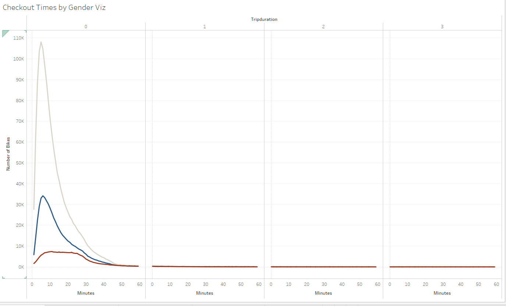
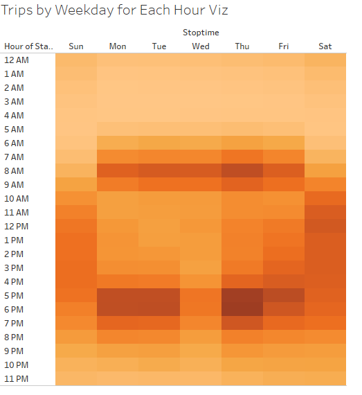
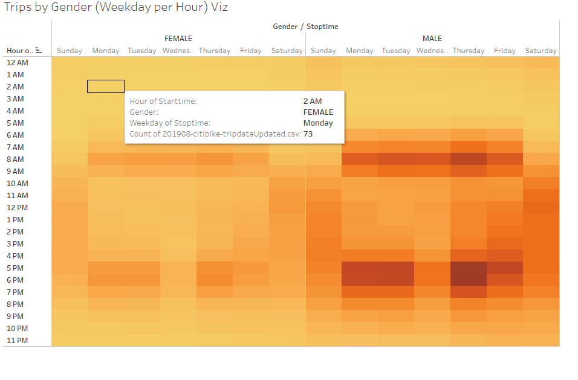
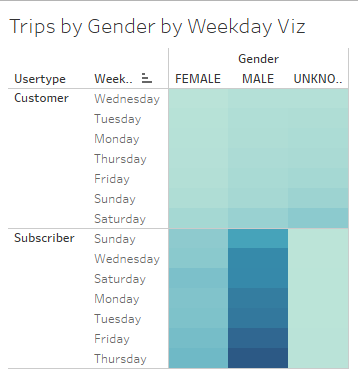
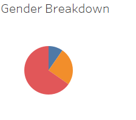
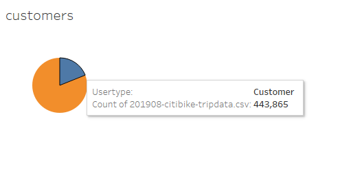

# Challenge 14

[link to dashboard](https://public.tableau.com/app/profile/sibtain.janmohamed/viz/Challenge14_16231133551220/BikeShareDashboard)

## Purpose
We’ll use Pandas to change the "tripduration" column from an integer to a datetime datatype. Then, using the converted datatype, we’ll create a set of visualizations to:

Show the length of time that bikes are checked out for all riders and genders
Show the number of bike trips for all riders and genders for each hour of each day of the week
Show the number of bike trips for each type of user and gender for each day of the week.

Finally, we’ll add these new visualizations to the two created in this module for your final presentation and analysis to pitch to investors.

## Results:

Usage of bikes in the first, second and third hour

Usage of bikes in the first, second and third hour. This graph also shows the usage by each of the gender

Shows the number of users per hour per day

Shows the number of users per hour per day.This graph also shows the usage by each of the gender 

This graph shows the number of subscriber versus the number of customers that use bikes on each day. It also shows the gender that uses the bikes

This shows all the bike users by gender

This shows all the bike users by type i.e customers and subscribers

## Summary

The graphs above display the usage of bikes by gender, customer type and the days and hours at which the bikes are mostly used. This will allow the investors to make a decision on how many bikes to have available during specific times and will also allow them to have the types of bikes which is male, female or unisex bikes. 

## Recommendations

1. It can be worth looking into the age of the users to ensure that in the event there are children using the bike share, they have enough bikes for them to use.
2. It is also worth to look into the number of accidents that occur, this will allow the investor to add the insurance cost in the amount they charge per user.
